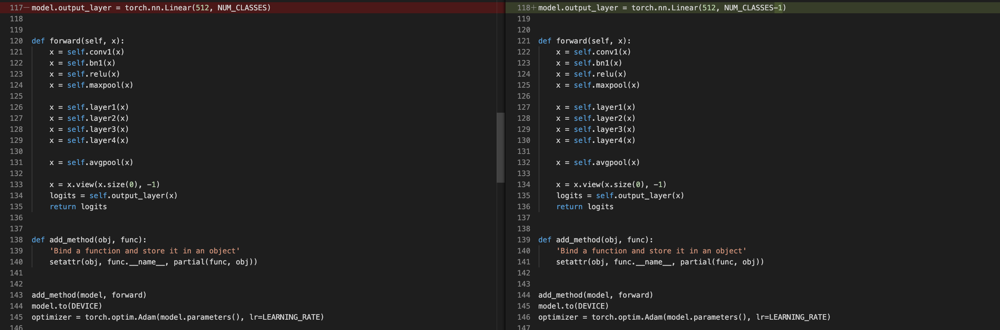
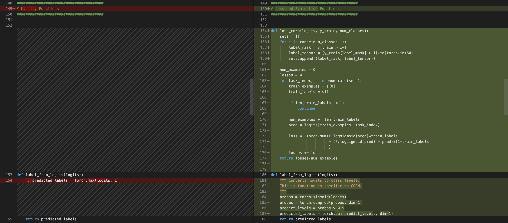
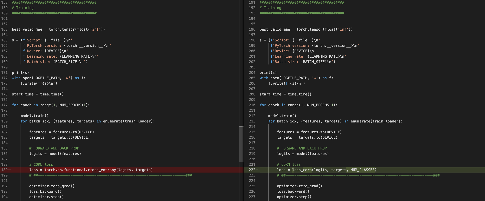

These are simple demo scripts for the different methods compared in this work, including our newly proposed CORN method. For these, we use MNIST only to keep it simple, but note that MNIST is not an ordinal dataset of course.

ResNet-34 version models for image classification / ordinal regression:

- `resnet34_classifier.py`: a conventional ResNet-34 image classifier with cross-entropy loss.
- `resnet34_coral.py`: ResNet-34 for ordinal regression with CORAL.
- `resnet34_corn.py`: ResNet-34 for ordinal regression with CORN.
- `resnet34_niu.py`: ResNet-34 for ordinal regression with Niu et al.'s method.

Multilayer perceptrons for tabular data:

- `mlp_classifier.py`
- `mlp_coral.py`
- `mlp_corn.py`
- `mlp_niu.py`

The code we used for the experiments in the paper can be found under [../refactored-version](../refactored-version).

## From Classifification with Cross Entropy Loss to CORN Ordinal Regression

Converting an existing neural network for classification to a neural network for ordinal regression via CORN is fortunately simpler than you might expect! Below is a file-diff between `resnet34_classifier.py` (left) and `resnet34_corn.py` (right) to explain the required modification.

### Step 1: Changing the output layer

CORN requires one fewer node in the output layer. Hence, you can change the number of output nodes from "Number of class labels" to "Number of class labels -1" as shown below:

### Step 2: Defining the CORN loss and label prediction functions

The main change we need to make for using CORN is to define the loss function. The loss defined below will take care of the conditional training set generation and loss computation. Then, it can be used as a drop-in replacement for PyTorch's `torch.nn.functional.cross_entropy`. In addition to the loss, there is also a slight difference in how we convert the logits into class labels, which is shown below via the `label_from_logits` function.

### Step 3: Updating the training loop

As mentioned above, we can now update the training loop using our `corn_loss` instead of `torch.nn.functional.cross_entropy`. Notice that one little detail and difference here is that the number of classes has to be provided as input to `corn_loss` as well, as shown below.

